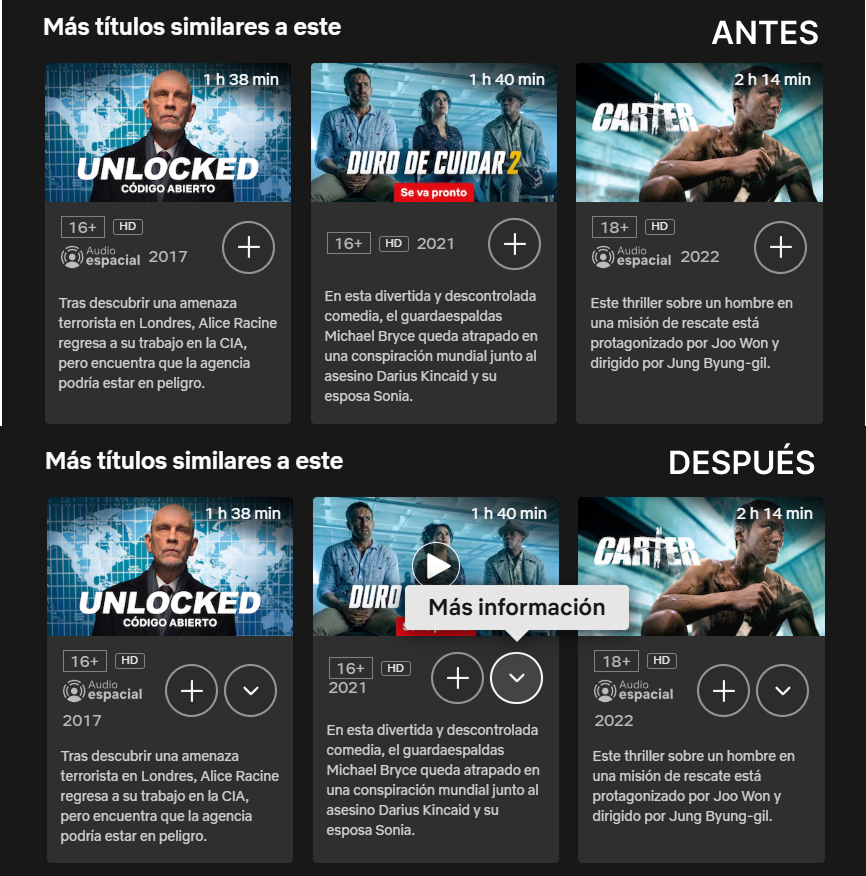

# Netflix Modal Navigator (Navegador de Modales de Netflix)

Extensión ligera para Google Chrome que optimiza la experiencia de navegación en **Netflix**, permitiendo explorar títulos sugeridos de forma fluida y sin interrupciones de reproducción.

<p align="center">
  
</p>

---

## 🚀 Propósito

Por defecto en Netflix, cuando estás en el modal de detalles de un título y haces clic en una tarjeta de la sección **"Más títulos similares a este"**:
- El comportamiento original de Netflix se mantiene intacto: si haces clic en cualquier parte de la tarjeta o en su icono de reproducir, el video comenzará a reproducirse inmediatamente.
- **La extensión añade un botón de información circular nativo (icono chevron "i")** al lado del botón "Mi lista" en cada tarjeta recomendada.
- Al pulsar este botón, la extensión intercepta el clic, evita la reproducción y **actualiza el modal de detalles** para mostrar el nuevo título seleccionado (`?jbv=ID_RECOMENDADO`) de forma instantánea y fluida, manteniendo al usuario dentro de la experiencia de exploración.

---

## 🛠️ Detalles de Arquitectura y Código

La extensión está diseñada bajo principios de **cero intrusión**, **alto rendimiento** y **mimetización visual**. A continuación se detalla su comportamiento técnico a nivel de código:

### 1. Detección y Aislamiento de Contexto (CSS-First)
Para evitar degradar el rendimiento al hacer scroll o cargar elementos, en [content.js](file:///d:/code/netflix-modal-navigator/content.js) evitamos parsear datos del tracking context de Netflix en el bucle principal. 
- Usamos consultas DOM ultrarrápidas para validar si la tarjeta pertenece exclusivamente al modal de detalles y no al mini-modal hover del inicio:
```javascript
const isInsideDetailModal = card.closest('.detail-modal') || 
                            (card.closest('.previewModal--container') && !card.closest('.mini-modal'));
```

### 2. Inyección Dinámica e Integridad Visual (Herencia de Clases)
En lugar de forzar estilos CSS fijos que podrían romperse con las actualizaciones de Netflix, el botón inyectado hereda directamente las clases nativas de los botones de la plataforma:
```javascript
infoBtn.className = addToListBtn.className;
```
Esto garantiza que nuestro botón de información comparta las transiciones, bordes, colores y comportamiento responsive originales definidos por los estilos de Netflix.

### 3. Navegación SPA mediante Eventos Nativos
Dado que Netflix está construida sobre React (Single Page Application), para actualizar el modal sin recargar la página completa, manipulamos el historial del navegador de forma segura:
```javascript
history.pushState(null, '', `/browse?jbv=${videoId}`);
window.dispatchEvent(new PopStateEvent('popstate'));
```
Esto alerta al enrutador interno de React para que actualice el componente del modal de detalles con el nuevo `videoId`.

### 4. Ciclo de Vida Eficiente (Observer con Debounce)
El script monitorea los cambios del DOM usando un `MutationObserver` optimizado. 
- Filtra eventos irrelevantes (solo reacciona a inserciones de nodos reales).
- Utiliza un **debounce de 100ms** para agrupar micro-mutaciones, garantizando que el proceso de inyección ocurra en un solo lote y evite el *layout thrashing* (recalculado excesivo de estilos).

### 5. Tooltips Reactivos y Oclusión Inteligente (CSS `:has()`)
Para que no choquen los tooltips dinámicos de la extensión con los nativos de Netflix, en [content.css](file:///d:/code/netflix-view/content.css) implementamos selectores avanzados:
- **Estilos Quirúrgicos**: Usamos `.videoMetadata--container-container:has(.nflx-info-button)` para aplicar estilos al botón de "Mi lista" únicamente cuando nuestro botón personalizado ha sido inyectado en esa tarjeta específica.
- **Oclusión Instantánea**: Ocultamos de forma reactiva cualquier tooltip nativo de Netflix si el cursor está sobre nuestro botón de información.
- **Limpieza en Navegación**: En `content.js` escuchamos eventos como `popstate` y `visibilitychange` para destruir tooltips flotantes huérfanos que puedan quedar huérfanos tras una navegación rápida.

---

## 📂 Estructura del Proyecto

* **[manifest.json](file:///d:/code/netflix-modal-navigator/manifest.json)**: Configuración técnica de la extensión (Declaración de scripts de contenido y estilos con ejecución en `document_end`).
* **[content.js](file:///d:/code/netflix-modal-navigator/content.js)**: Lógica principal de inyección de botones, ruteo SPA, control de eventos y ciclo de vida de los tooltips.
* **[content.css](file:///d:/code/netflix-modal-navigator/content.css)**: Estilos para emular el tooltip nativo de Netflix de forma exacta (caja, caret, sombras y animaciones de entrada).

---

## 💾 Instalación en Google Chrome

1. Abre Google Chrome.
2. Navega a `chrome://extensions/`
3. Activa el **"Modo de desarrollador"** (esquina superior derecha).
4. Haz clic en **"Cargar descomprimida"** (Load unpacked) en la esquina superior izquierda.
5. Selecciona el directorio raíz del proyecto.
